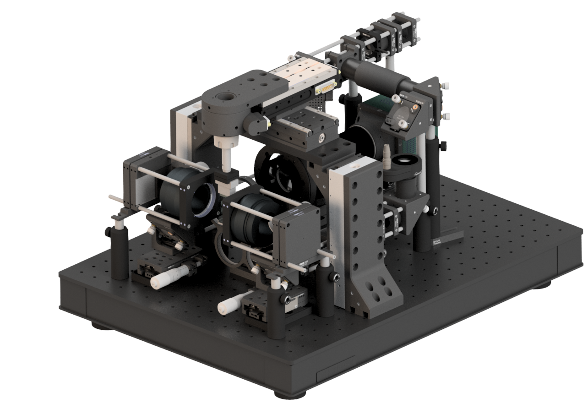

# Benchtop mesoSPIM hardware documentation

## Why Benchtop?
Being able to move the microscope from one lab to another, bring it to workshops, and send it to collaborators greatly increases its accessibility for biologists. Lab space is often a scarce asset, and having a compact microscope on the bench gives many advantages compared to bringing your samples to a large instrument in a dedicated room. 

## Key differences to mesoSPIM-v5

Benchtop mesoSPIM has smaller size, lower cost, and easier assembly than previous version (V5). The excitation optics (and lightsheet properties) are identical to V5, but with more compact folding. The detection path uses exchangeable telecentric lenses (available from various manufactureres), as opposed to one objective with zoom (Olympus PLAPO 1x). It is the same decision often made with DSLR cameras for professional photographers: prime lenses provide highest image quality but fixed magnification, compared to more flexible, but also more distorting zoom lenses. We tested and characterized selected telecentric lenses, but you are free to use your own.

