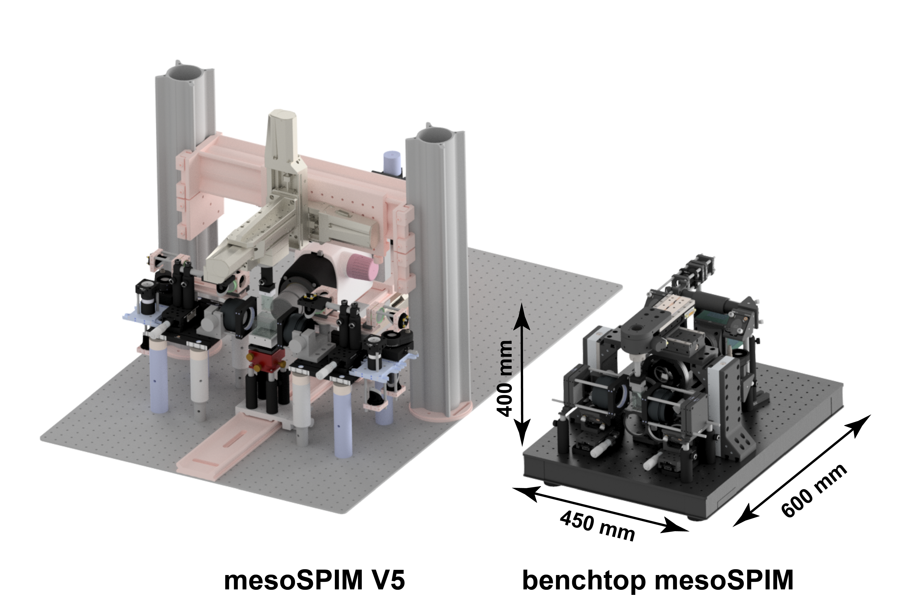

# Benchtop mesoSPIM hardware documentation

## Who is the mesoSPIM project for?
* You are looking for a versatile imaging platform for cleared tissue that can be tailored to your needs.
* Research groups and imaging facilities with experience in building and supporting custom microscopes.

## What are ideal imaging applications for a mesoSPIM?
* screening of large numbers of cleared samples
* imaging of cell populations or other structures (blood vessels, plaques, denrites, even axons) in whole cleared organs.

## Why Benchtop mesoSPIM?
Being able to move the microscope from one lab to another, bring it to workshops, and send it to collaborators greatly increases its accessibility for biologists. Lab space is often a scarce asset, and having a compact microscope on the bench gives many advantages compared to bringing your samples to a large instrument in a dedicated room. 

## Key differences to mesoSPIM-v5

Benchtop mesoSPIM has smaller size, lower cost, higher image quality, and easier assembly than [previous version (V5)](https://github.com/mesoSPIM/mesoSPIM-hardware-documentation). 

| 					| **mesoSPIM v.5** | **Benchtop mesoSPIM** |
|----------|----------|--------------------|
|**Isotropic optical resolution (approx.)**| 6 $\mu m$ (at 4x) | 3 $\mu m$ (at 5x) | 
|**Magnification range**| 0.63x - 6.3x | 0.9x - 20x | 
| **Detection objectives** 	|  Variable magnification (via motorized zoom)  | Fixed-magnification (manual exchange) |
| **Camera sensor FOV (diagonal)** | 19 mm |  25 mm |
| **Pixel size** | 6.5 $\mu m$  | 4.25 $\mu m$  | 
| **Pixels/image** | 4 MP | 15 MP |
| **Footprint** | 1 $m^2$ |  0.25 $m^2$ |
| **Mobile** |  no | yes |
| **Approximate cost, EUR** | 162k | 95k | 

The cost estimate does not include PC workstation and a screen. Version 1.5 costs include 4 laser lines (405, 488, 561, 638 nm) and optical table. Benchtop price includes the three most popular laser lines (488, 561, 638 nm) and 2x, 5x, 10x objectives. 

The number of custom parts in Benchtop is greatly reduced. 

The acquisition software remains the same, compatible with both versions of the microscope. 

## Build your own
Our project is free and open-source, allowing anyone to build their own microscope. The [BT-mesoSPIM wiki](https://github.com/mesoSPIM/benchtop-hardware/wiki) will guide you how to build, setup, and use the BT-mesoSPIM system.
